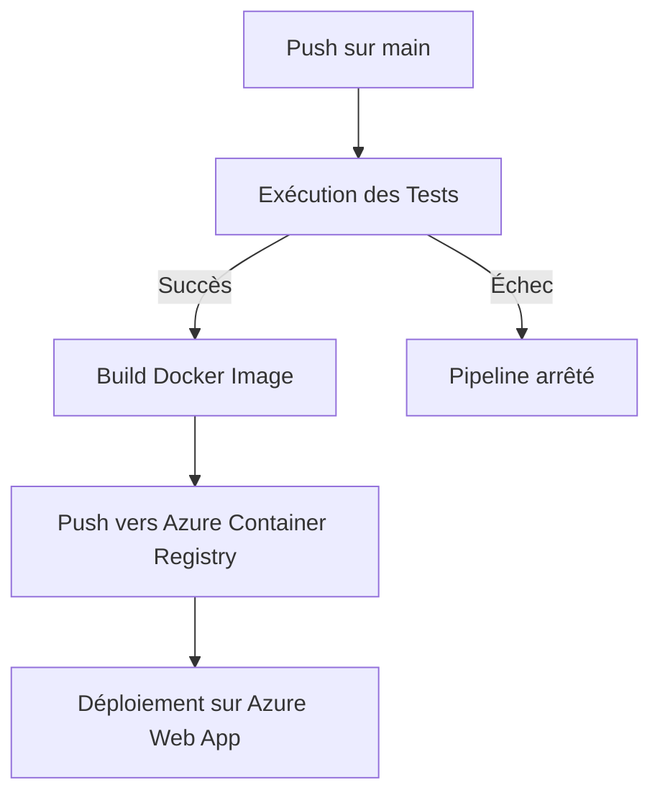

# Service de Calcul de Santé 🏥


Un microservice basé sur Python pour calculer les métriques de santé (IMC et BMR) avec une API REST. Le projet est conteneurisé avec Docker et déployé automatiquement sur Azure via GitHub Actions.

## 🌟 Fonctionnalités

- **Calculateur IMC**: Calcul de l'Indice de Masse Corporelle
- **Calculateur BMR**: Calcul du métabolisme de base avec l'équation Harris-Benedict
- **API REST**: Points de terminaison propres et bien documentés
- **Interface Web**: Interface utilisateur conviviale pour les calculs
- **Support Docker**: Application conteneurisée
- **Pipeline CI/CD**: Tests et déploiement automatisés
- **Hébergement Azure**: Déployé sur Azure Web App

## 📂 Structure du Projet

```
Health_Calculator_Project/
├── .github/
│   └── workflows/
│       └── ci.yml
├── static/
│   └── index.html
├── app.py
├── health_utils.py
├── test.py
├── test_api.py
├── requirements.txt
├── Dockerfile
├── .dockerignore
├── .gitignore
├── Makefile
└── README.md
```

## 🌐 Lien Github

Lien du projet github : [https://github.com/MathieuNz/Health_Calculator_Project/](https://github.com/MathieuNz/Health_Calculator_Project/)

## 🚀 Démo en Direct

Visitez l'application sur : [https://health-calculator-project.azurewebsites.net/](https://health-calculator-project.azurewebsites.net/)

## 📖 Documentation de l'API

### Points de Terminaison

#### GET /api
Renvoie la documentation de l'API et les points de terminaison disponibles.

#### POST /bmi
Calcule l'Indice de Masse Corporelle (IMC)

**Corps de la requête :**
```json
{
    "height": 1.75,  // Taille en mètres
    "weight": 70     // Poids en kilogrammes
}
```

**Réponse :**
```json
{
    "operation": "bmi",
    "result": 22.86,
    "interpretation": "Poids normal"
}
```

#### POST /bmr
Calcule le Métabolisme de Base (BMR)

**Corps de la requête :**
```json
{
    "height": 175,    // Taille en centimètres
    "weight": 70,     // Poids en kilogrammes
    "age": 25,        // Âge en années
    "gender": "male"  // "male" ou "female"
}
```

**Réponse :**
```json
{
    "operation": "bmr",
    "result": 1724.05  // Calories par jour
}
```

## 📐 Formules Mathématiques

### Calcul IMC
```
IMC = poids (kg) / (taille (m))²
```

### Calcul BMR (Équation Harris-Benedict)
Pour les hommes :
```
BMR = 88.362 + (13.397 × poids en kg) + (4.799 × taille en cm) - (5.677 × âge en années)
```
Pour les femmes :
```
BMR = 447.593 + (9.247 × poids en kg) + (3.098 × taille en cm) - (4.330 × âge en années)
```

## 🛠️ Développement Local

### Prérequis

- 🐍 Python 3.11+
- 🐳 Docker
- 〽️ Make (optionnel)

### Installation

1. **Cloner le dépôt**
```bash
git clone https://github.com/MathieuNz/Health_Calculator_Project.git
cd Health_Calculator_Project
```

2. **Créer un environnement virtuel**
```bash
python -m venv venv
source venv/bin/activate  # Sur Windows: venv\Scripts\activate
```

3. **Installer les dépendances**
```bash
pip install -r requirements.txt
```

### Lancer l'Application

**Avec Python directement :**
```bash
python app.py
```

**Avec Make :**
```bash
make run
```

**Avec Docker :**
```bash
docker build -t health-calculator .
docker run -p 5000:5000 health-calculator
```

### Exécuter les Tests

**Tests Unitaires :**
```bash
make test
```

**Tests API :**
```bash
make test-api
```

**Tests API Asynchrones :**
```bash
make test-api-async
```

## 🔄 Développement CI/CD

### Prérequis pour le CI/CD

1. **Comptes et Souscriptions**
   - Un compte GitHub
   - Une souscription Azure active
   - Un compte Docker Hub (optionnel)

2. **Outils en Local**
   - Azure CLI installé (`az --version`)
   - Git installé (`git --version`)
   - Docker installé (`docker --version`)

3. **Configuration Azure**
   - Azure CLI connecté (`az login`)
   - Droits suffisants pour créer :
     - Resource Groups
     - Container Registry
     - App Service Plan
     - Web Apps

4. **Configuration GitHub**
   - Accès aux paramètres du repository
   - Droits pour configurer les GitHub Actions
   - Droits pour gérer les secrets

5. **Accès et Permissions**
   - Permissions pour push sur la branche main
   - Accès au Azure Container Registry
   - Droits administrateur sur l'application web Azure

6. **Extensions Azure CLI Recommandées**
```bash
az extension add --name webapp
az extension add --name container-registry
```

### Pipeline GitHub Actions

La pipeline CI/CD est configuré dans `.github/workflows/ci.yml` et se compose de deux jobs principaux :

#### 1. Job de Test (`test`)
```yaml
test:
  runs-on: ubuntu-latest
  steps:
    - Installation de Python 3.11
    - Installation des dépendances
    - Exécution des tests unitaires
    - Démarrage de l'application Flask
    - Exécution des tests API
    - Exécution des tests API asynchrones
```

#### 2. Job de Build et Déploiement (`build-and-deploy`)
```yaml
build-and-deploy:
  needs: test  
  if: github.ref == 'refs/heads/main'  
  steps:
    - Connexion à Azure Container Registry
    - Build de l'image Docker
    - Push vers Azure Container Registry
    - Déploiement sur Azure Web App
```

### Configuration Azure

1. **Resource Group**
```bash
az group create --name health-calculator-rg --location francecentral
```

2. **Azure Container Registry**
```bash
az acr create \
    --resource-group health-calculator-rg \
    --name healthcalculatoracr \
    --sku Basic
```

3. **App Service Plan**
```bash
az appservice plan create \
    --name health-calculator-plan \
    --resource-group health-calculator-rg \
    --sku B1 \
    --is-linux
```

4. **Web App**
```bash
az webapp create \
    --resource-group health-calculator-rg \
    --plan health-calculator-plan \
    --name health-calculator-project \
    --runtime "PYTHON|3.11"
```

### Commandes Utiles Azure

```bash
# Voir les logs en temps réel
az webapp log tail --name health-calculator-project --resource-group health-calculator-rg

# Vérifier le statut de l'application
az webapp show --name health-calculator-project --resource-group health-calculator-rg --query state

# Redémarrer l'application
az webapp restart --name health-calculator-project --resource-group health-calculator-rg

# Voir les déploiements récents
az webapp deployment list --name health-calculator-project --resource-group health-calculator-rg

# Voir la configuration de l'application
az webapp config show --name health-calculator-project --resource-group health-calculator-rg
```

### Secrets GitHub Actions

Les secrets suivants doivent être configurés dans GitHub :

| Secret | Description |
|--------|-------------|
| `REGISTRY_LOGIN_SERVER` | URL du registry Azure (ex: healthcalculatoracr.azurecr.io) |
| `REGISTRY_USERNAME` | Nom d'utilisateur du registry Azure |
| `REGISTRY_PASSWORD` | Mot de passe du registry Azure |
| `AZURE_WEBAPP_PUBLISH_PROFILE` | Profil de publication de l'Azure Web App |

### Flow de Déploiement



### Variables d'Environnement

Les variables d'environnement sont gérées à plusieurs niveaux :

1. **Développement Local**
   - Fichier `.env` (non versionné)
   - Variables d'environnement système

2. **GitHub Actions**
   - Secrets GitHub
   - Variables d'environnement de workflow

3. **Azure Web App**
   - Configuration de l'application
   - Variables d'environnement Azure

### Tests dans le Pipeline

1. **Tests Unitaires**
   - Tests des fonctions de calcul (BMI, BMR)
   - Tests de validation des entrées

2. **Tests d'Intégration**
   - Tests des endpoints API
   - Tests de réponses HTTP
   - Validation des formats JSON

3. **Tests Asynchrones**
   - Tests parallèles des endpoints
   - Tests de performance basiques

### Monitoring et Logs

- Les logs sont disponibles dans :
  - GitHub Actions (pendant le déploiement)
  - Azure Web App (en production)
  - Container Registry (historique des images)

## 🔧 Stack Technique

* **Backend**: Python, Flask
* **Frontend**: HTML, Tailwind CSS, React
* **Conteneurisation**: Docker
* **Tests**: pytest
* **CI/CD**: GitHub Actions
* **Cloud**: Azure (Web App, Container Registry)
* **Outil de Build**: Make